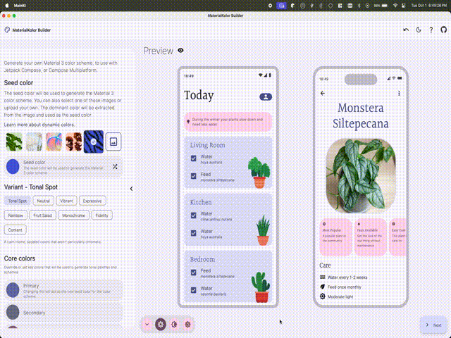

# MaterialKolor Builder

A Material3 Theme builder powered by [MaterialKolor](https://github.com/jordond/MaterialKolor).

Visit at [materialkolor.com](https://materialkolor.com).

## Table of Contents

- [Features](#features)
- [Platforms](#platforms)
- [Contributing](#contributing)
- [License](#license)

## Features

- Generate Material3 themes from a single color
- Select from a variety of preset images
- Upload your own image to extract a color from
- Change other settings like:
    - Palette Style
    - Contrast
    - Etc
- Export as standard Material Compose code, or a snippet to
  get [MaterialKolor](https://github.com/jordond/MaterialKolor) up and running.

## Inspiration

The heart of this app comes from the [material-color-utilities](https://github.com/material-foundation/material-color-utilities). A Java library for creating
Material3 color schemes. I commonized it in my [MaterialKolor](https://github.com/jordond/MaterialKolor) library, and created this app to
showcase it.

## Platforms

This app is written with Compose Multiplatform, and can be used on the following platforms:

- Android
- iOS (not tested)
- JVM (Desktop)
- Browser (wasm)

## Contributing

Contributions are greatly appreciated! If you find a bug, or have a feature request, please open an
issue. If you would like to contribute, please open a pull request.

## License

See [LICENSE](LICENSE) for more information.